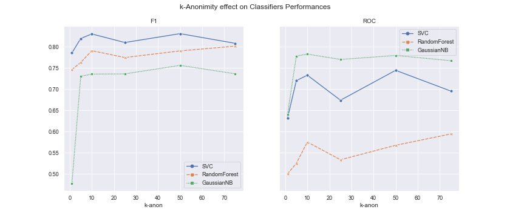

# Exercise 1 - Anonymisation
Group 7 - Oliver Stritzel - Dejana Stevanovic

Code can be found in the public [repository](https://github.com/oStritze/speml).

## Dataset
As a dataset we used the adults dataset from the [UCI ML Repository](https://archive.ics.uci.edu/ml/datasets/Adult). The dataset consits of a target variable, the income, which is denoted as higher or lower than 50.000\$ per year income. 
The dataset includes 14 variables, consisting of categorical and numerical values, with over 32000 rows. 

## Pre-Processing and General Classifier
We pre-processed the dataset, one-hot encoding categorical features, dropping some redundant ones (f.i. *education-num*). Rows with missing values were dropped. After pre-processing, we split the data into train and test (80/20) and trained three baseline classifiers on it (SVM-Classifier, Random-Forest, Gaussian-Naive Bayes). This was done without any anonymization. As metrics we used *f1-score* and *roc-auc score*. This results were achieved:

|         |      SVC |   RandomForest |   GaussianNB |
|---------|----------|----------------|--------------|
| f1      | 0.818 |       0.746 |     0.534 |
| roc_auc | 0.722 |       0.5      |     0.673 |

## Anonymization
For k-Anonymity through Anonymization, we used the Java library [ARX](https://arx.deidentifier.org/development/api/). Using the raw data as input we created the hierarchies to anonymize categorical variables. For the following variables hierarchies were created and they were used in different levels of k-Anonymity:

| age | capital-gain | capital-loss | edu-cation | fnlwgt | hours-per-week |marital-status | native-country | occu-pation | race | relation-ship | sex | work-class |
|---|---|---|---|---|---|---|---|---|---|---|---|---|
| x |  |   | x  |   |   | x  | x  | x  |  x | x  | x | x  |

We created datasetes for different *k*'s, namely  which were used as input for the same code that was used above, so again, pre-processing and scaling of variables was done. We ended up with the following metrics as results:

Comparing this with the results from above, one can see that Anonymization had a slightly positive effect on the more simpler classifiers Random-Forest and Naive-Bayes. 

[//]: # (This leads to the assumption that indeed some level of generalization through anonymization was good for the classifiers performance, which might have overfitted on the non-generalized data, but too much generalization might worsen the effect again. )

## Microaggregation
For utilizing Microaggregation, we used the Java library [mAnt](https://github.com/CrisesUrv/microaggregation-based_anonymization_tool). According to the specification, the precondition of having no missing values had to be fulfilled, therefore we first removed rows with missing values from the raw data. We further applied microaggregation on the cleaned version of dataset. We have created several configuration files that vary in specified value of parameter *k* which is used for protection of quasi-identifiers. Variables which were decided as quasi-identifiers for the k-Anonymity beforehand were also considered in microaggregation. Besides configuration files, ontologies for all semantic variables are provided in order to run the mAnt anonymization.

## Conclusion
We show that, for the two cases of k-anonymity achieved by Microaggregation and Anonymization, the  chosen predicting classifiers did not perform significantly worse after achieving k-anonymity with the same parameter settings. 

The anonymization of variables had a more visible effect on the performance (especially for the ROC-AUC Metric). Simple classifiers like the Naive Bayes used in this setup profited by the more generalized data achieved by k-Anonymity through Anonymization, maintaining a stable F1 and ROC-AUC score even with higher values for _k_. The Random-Forest seemed to achieve slighty better results with higher _k_ as well, probably due to less overfitting when data was generalized more. The Support Vector Classifer did not profit in all settings of _k_, where he achieved slightly better results (hence k=50 f.i.) but also slightly worse results (f.i. k=25). 

For Microaggregation, we observe a similar picture. After a slight drop in performance, a stable plateu for both performance metrics is achieved that seems to be increasing for higher _k_. The Random-Forest did not respond much to the microaggregation. This could be due to the scaling that was in place anyway. Overall the results were worse than before the microaggregation though, especially for SVC (f.i. ROC-AUC 0.722 vs 0.52 for k=10).

In general, it seems like more simple classifier do not mind the k-Anonymity in terms of performance, they even improve on it in certain environments. The Support Vector Machine did decrease in terms of performance. 

It is noteable that it seems to be important what _k_ is used in a dataset, thus this could be introduced as an additional tuning paramter besides the obvious GridSearch ideas when tuning a classifier for performance.